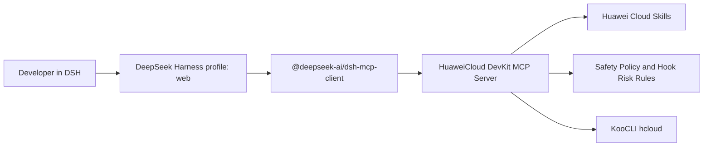

# DeepSeek Harness Integration

HuaweiCloud DevKit supports DeepSeek Harness (DSH) through the existing MCP
server and Skills. V1 does not ship a native Cordis plugin because the MCP path
keeps the Huawei Cloud tool schema, safety policy, and KooCLI wrapper shared
across agents.

## Architecture



## Installation Layout

`npx --yes huaweicloud-devkit install --target dsh` writes these files:

- `$DSH_HOME/skills`: Huawei Cloud Skills used by DSH skill discovery.
- `$DSH_HOME/huaweicloud-plugins/src`: the local MCP server implementation.
- `$DSH_HOME/huaweicloud-plugins/safety`: shared safety policy and risk rules.
- `$DSH_HOME/profiles/web/cordis.patch.yml`: a managed Cordis patch row that
  connects DSH to the Huawei Cloud MCP server.

If `DSH_HOME` is not set, the installer uses `~/.dsh`.

## Managed Patch

The installer owns only the block between these markers:

```yaml
# HuaweiCloud DevKit DSH integration start
- insert:
    - id: mcp-huaweicloud
      name: '@deepseek-ai/dsh-mcp-client'
      config:
        serverName: huaweicloud
        transport: stdio
        command: node
        args:
          - '<DSH_HOME>/huaweicloud-plugins/src/mcp-server.mjs'
        env:
          HUAWEICLOUD_AGENT_TOOLKIT_MODE: local
          HDKITSERVICE_ENDPOINT: ''
        failOnStartupError: false
# HuaweiCloud DevKit DSH integration end
```

Existing user patch entries are preserved. `update --target dsh` replaces the
managed block in place, and `uninstall --target dsh` removes only that block.

## Commands

```bash
npx --yes huaweicloud-devkit install --target dsh
npx --yes huaweicloud-devkit status --target dsh
npx --yes huaweicloud-devkit update --target dsh
npx --yes huaweicloud-devkit uninstall --target dsh
```

After install or update, restart the DSH session so the MCP client can load the
new patch.

## MCP Client Dependency

DSH needs `@deepseek-ai/dsh-mcp-client` in the `web` profile. The installer
detects an existing package and tries a best-effort local installation when DSH
or pnpm is available. If it cannot install the package automatically, run:

```bash
npx @deepseek-ai/dsh plugin --profile web add @deepseek-ai/dsh-mcp-client
```

If pnpm is missing, enable it first:

```bash
corepack enable pnpm
```

## Safety And Auth

The DSH target uses the same MCP tools as other agents:

- read-only KooCLI inspection by default;
- explicit user approval for write-capable commands;
- command, artifact, and deployment-plan risk checks;
- credential redaction and no secret writes into agent configuration.

Use `npx --yes huaweicloud-devkit auth init` to configure the shared credential
vault, then restart DSH. `auth status --target dsh` reports whether the DSH MCP
registration is present without printing credentials.

## Future Native Cordis Support

A native Cordis plugin can be considered later if DSH becomes a primary agent
runtime for Huawei Cloud users. Until then, the MCP adapter keeps V1 smaller,
safer, and easier to regression test.
